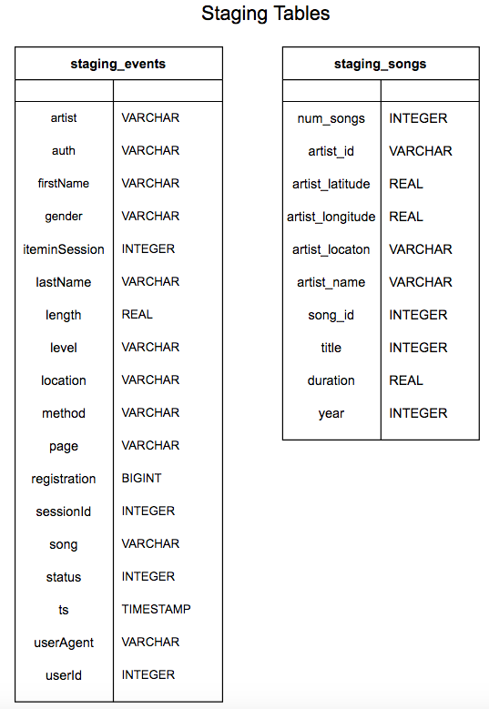
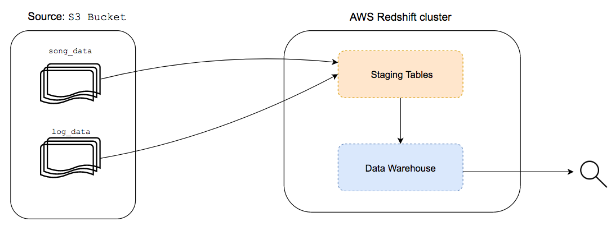
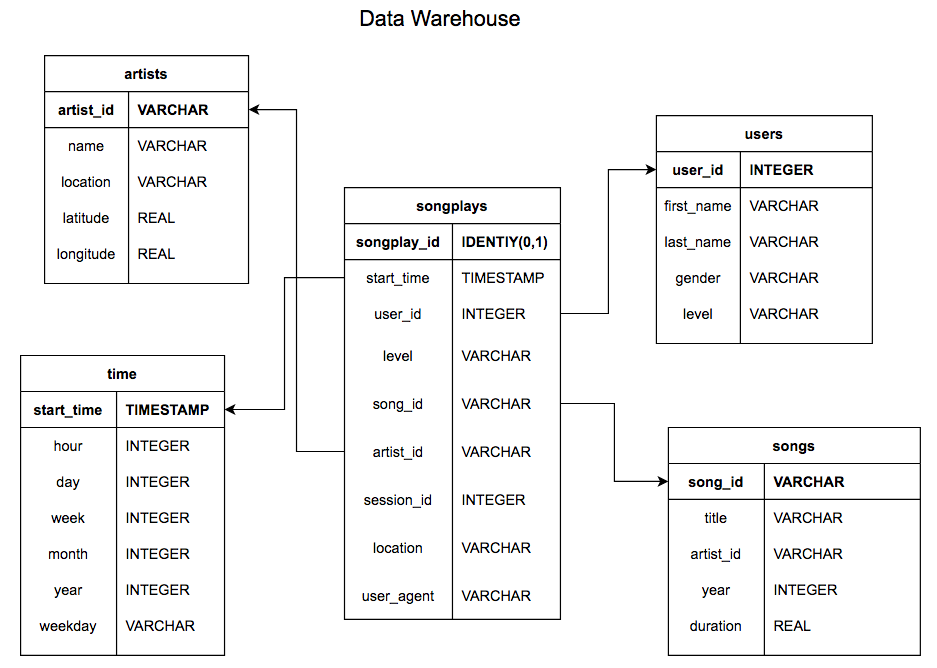

# Data Warehouse

## Objective

---

Create a data warehouse of Sparkify's users activity from several **large** sources by implementing a ETL pipeline to enable fast queries of data on AWS Redshift.

## Implementation

---

### ETL pipeline

We are dealing with large amount of data and we have the need to transform it to allow further analysis. Below is explained this process.

##### Source
We have two sources that are stored in a AWS S3 bucket: 
- Songs Dataset: [Million Song Dataset](http://millionsongdataset.com/).
- Logs Dataset: Activity logs of users using the Sparkify app.

##### Extraction
Since we need to extract large amounts of data for later transformations, as first step the data is copied, from the source, to *stagging tables* in a AWS Redshift cluster. This is a good practice to load data from AWS S3 since we can use the COPY command that allows to do this process in parallel. The staging tables are visualize below:





##### Tranformation and Loading
Given that the *logs dataset* only have metadata about user's activity we must extract the information about songs from the *songs dataset*. To do so, the data from the staging tables was transformed and loaded into the data warehouse tables. It should be noted that this data warehouse is stored in a AWS Redshift cluster that allows fast queries of the data. 




### Design

The data warehouse have a star schema optimized for queries on song play analysis. The names of the songs provided on the *logs dataset* are used to create the *songs* and *artists* tables extracting the relevant information from the *songs dataset*. The attributes of users are stored in the *users* table. Finally, attributes regarding the time of logs are created and stored in the *time* table. The data warehouse have a star schema that simplifies queries and is used commonly for online analytics processing. The tables are as follows:

- Fact Table
    - `songplays`: Logs of songs plays 
    
- Dimension Tables
    - `users`: Contains users attributes
    - `songs`: Contains songs attributes
    - `artists`: Contains artists attributes
    - `time`: Contains time attributes

The schema can be visualize as follows:



### Files

- `create_tables.py`: contains functions to drop/create database and drop/create tables

- `sql_queries.py`: contains SQL queries used in ETL.

- `etl.py`: contains functions to process from datasets and load data to database

- `test.ipynb`: iPython notebook that can be used to test queries to database

## Instructions

---

1. Run `create_tables.py` to create database and tables

2. Run `etl.py` to extract, transform and load data into tables

3. You can make queries from `test.ipynb`

> NOTE: Is assumed that connection configuration is on `dwh.cfg` file

## Query Examples

---

> Number of plays per location

```
SELECT location, COUNT(*) FROM songplays GROUP BY location;
```

> Number of plays per level of user

```
SELECT level, COUNT(*) FROM songplays GROUP BY level;
```